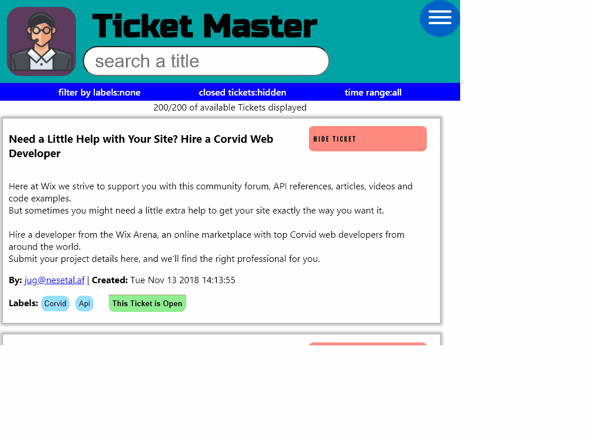

# Ticket Master 
made to serve costumer support personnel in accessing and taking care of tickets sent by clients.

## Features
- [x] [__available__](https://caring-sequoia-nigella.glitch.me/) on Glitch.
- [x] __Loads__ available tickets on site load
- [x] __Search__ for tickets by their title (case insensitive)
- [x] __Displays__ the tickets, title, content and data 
    - [x] __Read__
    - [x] __Email__ the sender directly by clicking the Email
    - [x] __Hide__ the ticket from view
    - [x] __Filter by label__ by clicking the labels on the ticket
    - [x] __Close__ tickets when you are done with them or __reopen__ as you see fit. closed tickets will be grayed out
-[x] a nice popup __menu__ to manage your preferences 
    -[x] __change__ up the interface by choosing one of our available colour presets or pick your own 
    -[x] __Hide__ closed tickets or show them 
    -[x] filter tickets by their __Creation Time__ 
    -[x] filter by tickets __labels__. all  currently available in tickets are displayed.
- [x] __status bar__ shows what filters you have active and tells you how many tickets are hidden and displayed.
you can also __unhide__ any hidden tickets.
-[x] A __Snazzy__ design! try hovering and clicking:  
    - popup menu
    - searchbar
    - hide buttons
    - close ticket button
    - unhide button

### a brief demo:

## credits
where they are due;
I have used ideas and code from these sources
- [hamburgers](https://jonsuh.com/hamburgers/) by Jonathan Suh
- [Flip Button](https://codepen.io/alphardex/pen/VwwVLdM) by Alphardex
- [Sliced Button](https://codepen.io/saraharaya/pen/NpwdGv) by Sarah Araya
